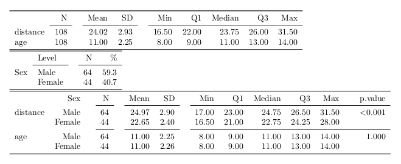

<!--
  %\VignetteEngine{knitr::rmarkdown}
  %\VignetteIndexEntry{Using papeR with Markdown}
-->


```{r initialization, include=FALSE}
library("knitr")
options(knitr.table.format = 'markdown')
opts_chunk$set(message = FALSE, warning = FALSE, fig.path = "graphics/fig-",
               out.width = "480px")
set.seed(1234)
```


# Using **papeR** -- A short tutorial

This is a short tutorial that covers some of the main features of the R package **papeR**.

The main goal of the package is to ease statistical reporting and thus to ease
reproducible research. By relying on powerful tools such as the `Sweave`, or the
packages **knitr** and **xtable**, the package can be easily integrated in
existing workflows.

- First of all, the package provides an infrastructure to handle variable labels which
are used in all other functions (`labels()`).

- The package allows to create (complex) summary tables of the data sets (`summarize()`) and
to easily plot the data (`plot()` for labeled `data.frame`s).

- Finally, the package allows to enhance summary tables of statistical models by
(possibly) adding confidence intervals, significance stars, odds ratios, etc. and
by separating variable names and factor levels (`prettify()`).

## Getting started

Before we start, we need to install the package. The package can be easily obtained
from [CRAN](http://CRAN.R-project.org/package=papeR), e.g. via the command
```{r install_CRAN, eval = FALSE}
install.packages("papeR")
```

To install the latest development version, one can use **devtools** to install
packages from [GitHub](http://github.com/hofnerb/papeR). Therefore we need to
install and load **devtools** before we can install **papeR**:

```{r install_github, eval=FALSE}
install.packages("devtools")
library("devtools")
install_github("hofnerb/papeR")
```

Now we can load the package

```{r load_pkg}
library("papeR")
```

## The package

### Labeled data frames

To be able to use *all* features of the package, we first need to create a labeled
data frame. We need labeled data frames to use the special `plot()` function (see below).
All other functions do not strictly require labeled data frames but can exploit
the labels.

Labels in **papeR** are stored as attributes of the variables, i.e., each variable
in a labeld data frame has an attribute `"variable.label"`, and the data set gets an
additional class `'ldf'`. Other packages store variable labels differently. E.g.
the function `read.spss()` from the package **foreign** stores variable labels as
a single attribute of the data set. The package **papeR** is also capable of using
these labels. For details see the section "Conversion to labeled data frames".

#### Setting and extracting labels

If we create a new `data.frame` we can extract and set variable labels using the
function `labels()`. We use the `Orthodont` data package **nlme** throughout this
tutorial. First load the data
```{r}
data(Orthodont, package = "nlme")
## keep the original data set for later use
Orthodont_orig <- Orthodont
```
To check if the data set is a labeled data set (i.e., of class `'ldf'`), we can use
```{r}
is.ldf(Orthodont)
```

Despite the fact that we do not have a labeled data frame, we can query the labels.
In this case, we simply get the variable names as no labels were set so far
```{r}
labels(Orthodont)
```
This is a convenient feature, as we thus can relly on the fact that we will always
have *some* variable labels.

To explicitly set labels, which are usually more descriptive than the variable names,
we can simply assign a vector of labels. We use some of the information which is
given on the help page of the `Orthodont` data and use it as labels:
```{r}
labels(Orthodont) <- c("fissure distance (mm)", "age (years)", "Subject", "Sex")
```
If we now query if `Orthodont` is a labeled data frame and extract the labels, we get
```{r}
is.ldf(Orthodont)
class(Orthodont)
```
We see that by setting variable labels, we also add the class `'ldf'` to the data frame.
Now, the labels are
```{r}
labels(Orthodont)
```


#### Advanced labelling

We can also set or ectract labels for a subset of the variables using the option
`which`, which can either be a vector of variable names or indices. Let's capitalize
the labels of `distance` and `age` to make it consitent with `Subject` and `Sex`:
```{r}
## set labels for distance and age
labels(Orthodont, which = c("distance", "age")) <- c("Fissure distance (mm)", "Age (years)")
## extract labels for age only
labels(Orthodont, which = "age")
## or for the first two variables (i.e., distance and age)
labels(Orthodont, which = 1:2)
```

#### Conversion to labeled data frames

Instead of manually setting labels, we can simply convert a data frame to a
labeled data frame, either with the function `as.ldf()` or with `convert.labels()`.
Actually, both calls reference the same function (for an object of class `data.frame`).

While `as.ldf()` can be seen as the classical counterpart of `is.ldf()`, the
function name `convert.labels()` is inspired by the fact that these functions either
convert the variable names to labels or convert other variable labels to **papeR**-type
variable labels. Hence, these functions can, for example, be used to convert labels
from data sets which are  imported via the function `read.spss()` to **papeR**-type
variable labels.

If no variable labels are specified, the original variable names are used.
```{r}
Orthodont2 <- convert.labels(Orthodont_orig)
class(Orthodont2)
labels(Orthodont2)
```

### Plotting labeled data frames

For data frames of class `'ldf'`, there exist special plotting functions:
```{r plot_labeled_dataframe}
par(mfrow = c(2, 2))
plot(Orthodont)
```

As one can see, the plot type is automatically determined
based on the data type and the axis label is defined by
the `labels()`.

To obtain group comparisons, we can use grouped plots. To plot all variable in the
groups of `Sex` one can use
```{r grouped_plot}
par(mfrow = c(1, 3))
plot(Orthodont, by = "Sex")
```

We can as well plot everything against the metrical variable `distance`
```{r with_x}
par(mfrow = c(1, 3))
plot(Orthodont, with = "distance")
```

To plot only a subset of the data, say all but `Subject`, against `distance` and
suppress the regression line we can use
```{r univariate_no_regressionline}
par(mfrow = c(1, 2))
plot(Orthodont, variables = -3, with = "distance", regression.line = FALSE)
```

Note that again we can use either variable names or indices to specify the variables
which are to be plotted.


### Summary tables

One can use the command `summarize()` to automatically produce summary tables for
either numerical variables (i.e., variables where `is.numeric()` is `TRUE`) or
categorical variables (where `is.factor()` is `TRUE`). We now extract a summary
table for numerical variables of the `Orthodont` data set:
```{r}
data(Orthodont, package = "nlme")
summarize(Orthodont, type = "numeric")
```

Similarly, we can extract summaries for all factor variables. As one of the factors
is the `Subject` which has `r nlevels(Orthodont$Subject)` levels, each with
`r unique(table(Orthodont$Subject))` observations, we exclude this from the summary
table and only have a look at `Sex`
```{r}
summarize(Orthodont, type = "factor", variables = "Sex")
```

Again, as for the plots, one can specify `group`s to obtain grouped statistics:
```{r}
summarize(Orthodont, type = "numeric", group = "Sex", test = FALSE)
```

Per default, one also gets `test`s for group differences:
```{r}
summarize(Orthodont, type = "numeric", group = "Sex")
```

### Converting summaries to PDF

So far, we only got standard R output. Yet, any of these summary tables can be
easily converted to LaTeX code using the package **xtable**. In **papeR** two
special functions `xtable.summary()` and `print.xtable.summary()` are defined
for easy and pretty conversion. In `Sweave` we can use
```r
<<echo = FALSE, results = tex>>=
xtable(summarize(Orthodont, type = "numeric"))
xtable(summarize(Orthodont, type = "factor", variables = "Sex"))
xtable(summarize(Orthodont, type = "numeric", group = "Sex"))
@
```
and in **knitr** we can use
```r
<<echo = FALSE, results = 'asis'>>=
xtable(summarize(Orthodont, type = "numeric"))
xtable(summarize(Orthodont, type = "factor", variables = "Sex"))
xtable(summarize(Orthodont, type = "numeric", group = "Sex"))
@
```
to get the following PDF output



Note that per default, `booktabs` is set to `TRUE` in `print.xtable.summary`, and
thus `\usepackage{booktabs}` is needed in the header of the LaTeX report. For details
on LaTeX summary tables see the dedicated vignette, which can be obtained, e.g., via
`vignette("papeR\_with\_latex", package = "papeR")`. See also there for more details
on summary tables in general.

### Converting summaries to Markdown

To obtain markdown output we can use, for example, the function `kable()` from
package **knitr** on the summary objects:

```r
```{r, echo = FALSE, results = 'asis'}
library("knitr")
kable(summarize(Orthodont, type = "numeric"))
kable(summarize(Orthodont, type = "factor", variables = "Sex", cumulative = TRUE))
kable(summarize(Orthodont, type = "numeric", group = "Sex", test = FALSE))
```
```

which gives the following results

```{r, echo = FALSE, results = 'asis'}
library("knitr")
kable(summarize(Orthodont, type = "numeric"))
kable(summarize(Orthodont, type = "factor", variables = "Sex", cumulative = TRUE))
kable(summarize(Orthodont, type = "numeric", group = "Sex"))
```


### Prettify model output

To prettify the output of a linear model, one can use the function
`prettify()`. This function adds confidence intervals, properly
prints p-values, adds significance stars to the output (if desired)
and additionally adds pretty formatting for factors.

```{r}
linmod <- lm(distance ~ age + Sex, data = Orthodont)
## Extract pretty summary
(pretty_lm <- prettify(summary(linmod)))
```

The resulting table can now be formatted for printing using packages like
**xtable** for LaTeX which can be used in `.Rnw` files with the option
`results='asis'` (in **knitr**) or `results = tex` (in `Sweave`)

```{r, results='hide'}
xtable(pretty_lm)
```

In markdown files (`.Rmd`) one can instead use the function `kable()` with the
chunk option `results='asis'`. The result looks as follows:

```{r, results='asis'}
kable(pretty_lm)
```

#### Supported objects

The function `prettify` is *currently* implemented for objects of the following classes:

* `lm` (linear models)
* `glm` (generalized linear models)
* `coxph` (Cox proportional hazards models)
* `lme` (linear mixed models; implemented in package **nlme**)
* `mer` (linear mixed models; implemented in package **lme4**, version < 1.0)
* `merMod` (linear mixed models; implemented in package **lme4**, version >= 1.0)
* `anova` (anova objects)

## Summary and Outlook

The package is intended to ease reporting of standard data analysis tasks such as
descriptive statistics, simple test results, plots and to prettify the output of
various statistical models.

**papeR** is under active development. Feature requests, bug reports, or
patches, which either add new features or fix bugs, are always welcome. Please use
the [GitHub](http://github.com/hofnerb/papeR) page.
